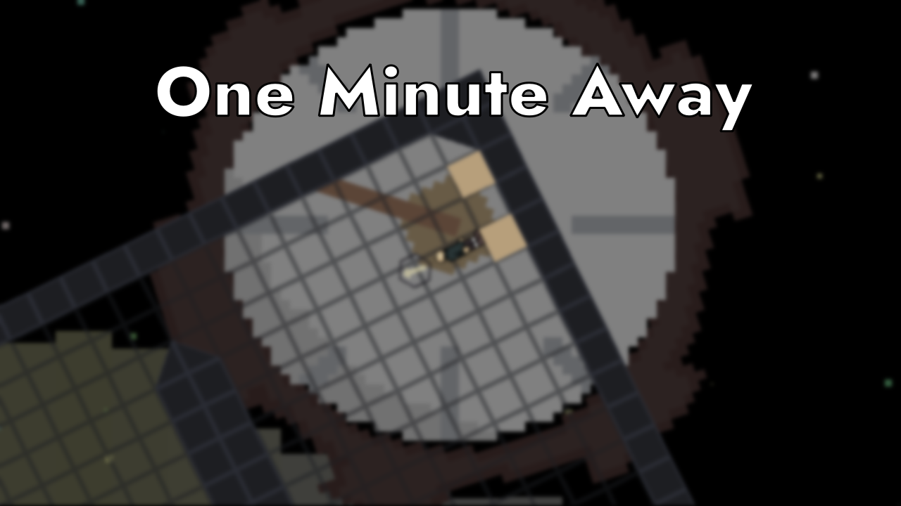

# One Minute Away - Ludum Dare 51

|             |                                                                                |
|-------------|--------------------------------------------------------------------------------|
| **Theme**   | _Every 10 seconds_                                                             |
| **Date**    | _October 2022_                                                                 |
| **Type**    | _Compo_                                                                        |
| **Concept** | _2D platformer game where you punch boxes and tries to save the world._        |

**:rocket: [Play it here!](https://srynetix.github.io/ludumdare51/)**

Welcome on my 5th **Ludum Dare** Compo entry!

Man, this theme was **HARD**. Not just hard but really **HARD**.  
I brainstormed during hours finding a pitch fitting for this theme, so there you go *(narrator voice activated)*:

> Time is collapsing. You, the hero of this story, have to once again save the world by fighting the Time itself, avoiding traps and getting [deeper and deeper](https://github.com/Srynetix/deep-space-beat).
> 

Here's what the **Time** will do to block you:
- *every 10 seconds*, you will be weaker, slower
- *every 10 seconds*, you will receive a special effect in your face
- but fortunately for you, if you break the *time locks*, you will take precious seconds from the **Time** itself.

If you are too slow to finish the level, consider yourself **frozen until the end of the ages** :hourglass:.

Make sure to finish all the levels, and let me know if you enjoyed the game :wink:.  
...ah and put your headphones on, make sure you play with sound :notes:!

**Software used**:
- [Godot Engine 3.5.1](https://godotengine.org/) with my [sxgd](https://github.com/Srynetix/sxgd) plugin collection,
- [Pixel Studio](https://store.steampowered.com/app/1204050/Pixel_Studio__pixel_art_editor/),
- [Krita](https://krita.org/),
- [FL Studio](https://www.image-line.com/fl-studio/)

**Assets used**:
- The [Jost* font](https://github.com/indestructible-type/Jost)

_Good luck, and have fun!_

## Preview

